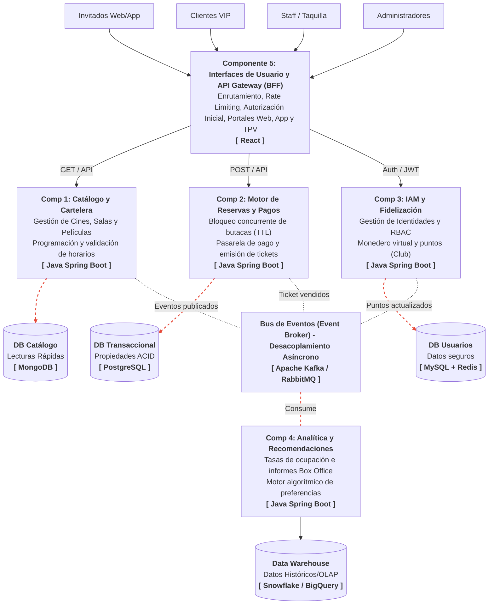

Se hará más adelante.

## Estructura proyecto

```mermaid
flowchart TD
    %% Roles de usuario
    U1[Invitados Web/App]
    U2[Clientes VIP]
    U3[Staff / Taquilla]
    U4[Administradores]

    %% Componente 5 (API Gateway / BFF)
    C5["<b>Componente 5: Interfaces de Usuario y API Gateway (BFF)</b><br/>Enrutamiento, Rate Limiting, Autorización Inicial, Portales Web, App y TPV<br/><b>[ React ]</b>"]

    %% Conexiones desde usuarios hacia el Componente 5
    U1 --> C5
    U2 --> C5
    U3 --> C5
    U4 --> C5

    %% Microservicios de Nivel Intermedio
    C1["<b>Comp 1: Catálogo y Cartelera</b><br/>Gestión de Cines, Salas y Películas<br/>Programación y validación de horarios<br/><b>[ Java Spring Boot ]</b>"]
    C2["<b>Comp 2: Motor de Reservas y Pagos</b><br/>Bloqueo concurrente de butacas (TTL)<br/>Pasarela de pago y emisión de tickets<br/><b>[ Java Spring Boot ]</b>"]
    C3["<b>Comp 3: IAM y Fidelización</b><br/>Gestión de Identidades y RBAC<br/>Monedero virtual y puntos (Club)<br/><b>[ Java Spring Boot ]</b>"]

    %% Conexiones Síncronas desde C5 a Microservicios
    C5 -- "GET / API" --> C1
    C5 -- "POST / API" --> C2
    C5 -- "Auth / JWT" --> C3

    %% Bases de Datos
    DB1[("<b>DB Catálogo</b><br/>Lecturas Rápidas<br/><b>[ MongoDB ]</b>")]
    DB2[("<b>DB Transaccional</b><br/>Propiedades ACID<br/><b>[ PostgreSQL ]</b>")]
    DB3[("<b>DB Usuarios</b><br/>Datos seguros<br/><b>[ MySQL + Redis ]</b>")]

    %% Conexiones Síncronas a Bases de Datos
    C1 --> DB1
    C2 --> DB2
    C3 --> DB3

    %% Bus de Eventos
    BUS["<b>Bus de Eventos (Event Broker) - Desacoplamiento Asíncrono</b><br/><b>[ Apache Kafka / RabbitMQ ]</b>"]

    %% Conexiones Asíncronas desde Microservicios al Bus de Eventos
    C1 -.-|Eventos publicados| BUS
    C2 -.-|Ticket vendidos| BUS
    C3 -.-|Puntos actualizados| BUS

    %% Componente 4 (Analítica)
    C4["<b>Comp 4: Analítica y Recomendaciones</b><br/>Tasas de ocupación e informes Box Office<br/>Motor algorítmico de preferencias<br/><b>[ Java Spring Boot ]</b>"]

    %% Conexión del Bus de Eventos a Comp 4
    BUS -.-|Consume| C4

    %% Data Warehouse
    DW[("<b>Data Warehouse</b><br/>Datos Históricos/OLAP<br/><b>[ Snowflake / BigQuery ]</b>")]

    %% Conexión Síncrona a Data Warehouse
    C4 --> DW

    %% Estilos de líneas para simular Síncrono vs Asíncrono
    linkStyle 7,8,9 stroke:#e74c3c,stroke-width:2px,stroke-dasharray: 5 5;
    linkStyle 13 stroke:#e74c3c,stroke-width:2px,stroke-dasharray: 5 5;
```